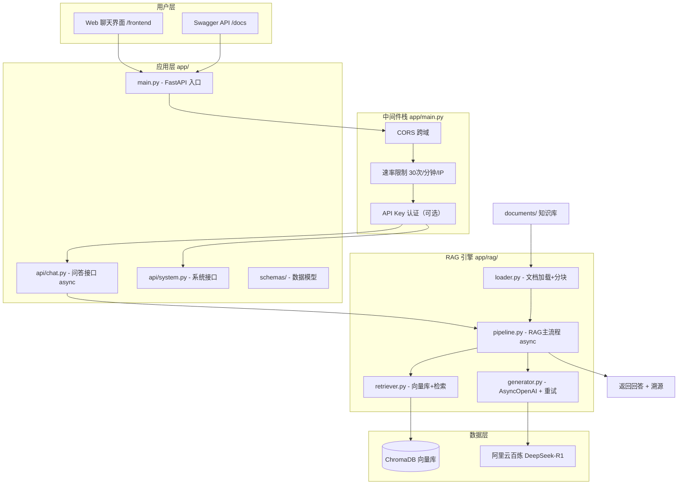
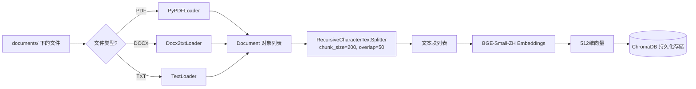
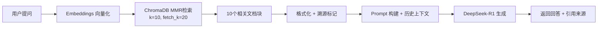

# RAG 知识库智能问答系统

基于 RAG（检索增强生成）架构的企业级私有知识库问答系统，支持多轮对话、文档溯源、前端可视化交互。

## 技术栈

| 层级 | 技术 |
|------|------|
| 前端 | HTML + CSS + JavaScript（原生） |
| Web 框架 | FastAPI + Uvicorn（全异步） |
| RAG 框架 | LangChain |
| 向量数据库 | ChromaDB |
| Embedding | BGE-Small-ZH (BAAI) |
| LLM | DeepSeek-R1-Distill-Qwen-7B（阿里云百炼 AsyncOpenAI） |
| 测试 | Pytest + Ruff（48 个测试用例） |
| 部署 | Docker + Docker Compose |

## 项目成果

- 自建 **440 条** 标注测试集（准确/模糊/干扰三类场景）
- 准确问答召回率 **83.67%**，干扰题拒答率 **91%**
- 平均响应时间 **3.5 秒**
- 评测效率从人工 2 小时 → 自动 5 分钟，提升 **96%**
- 通过参数调优，准确题召回率从 71.43% 提升至 83.67%

## 快速开始

### 环境配置

```bash
# 1. 进入项目目录
cd rag-knowledge-base

# 2. 激活虚拟环境
source .venv/bin/activate

# 3. 安装依赖
pip install -r requirements.txt

# 4. 配置环境变量（.env 文件）
# DASHSCOPE_API_KEY=your_api_key
# DASHSCOPE_BASE_URL=https://dashscope.aliyuncs.com/compatible-mode/v1
```

### 构建知识库索引

```bash
python -m scripts.build_index
```

### 启动 Web 服务

```bash
python -m app.main
```

打开浏览器访问：
- 聊天界面：http://localhost:8000/
- API 文档：http://localhost:8000/docs

### 运行测试

```bash
python -m pytest tests/ -v
```

### 运行评测

```bash
python -m scripts.run_eval
```

### CLI 交互模式

```bash
python -m scripts.chat_cli
```

## 系统架构



## 数据流程

### 构建阶段（运行一次）



### 查询阶段（每次对话）



## 项目结构

```
rag-knowledge-base/
├── app/                           # 应用核心代码
│   ├── main.py                    # FastAPI 入口（CORS/限流/认证中间件）
│   ├── config.py                  # 全局配置（环境变量注入）
│   ├── logger.py                  # 日志模块
│   │
│   ├── api/                       # API 层
│   │   ├── chat.py                # 问答接口（async）
│   │   └── system.py              # 系统接口（线程安全统计）
│   │
│   ├── rag/                       # RAG 引擎（全异步）
│   │   ├── loader.py              # 文档加载 + 分块
│   │   ├── retriever.py           # Embeddings + 向量库 + 检索
│   │   ├── generator.py           # AsyncOpenAI + 3 次重试
│   │   └── pipeline.py            # RAG 主流程（async / 线程安全）
│   │
│   ├── evaluation/                # 评测模块
│   │   ├── metrics.py             # 指标计算
│   │   └── runner.py              # 批量评测
│   │
│   └── schemas/                   # Pydantic 数据模型
│       └── chat.py                # Request/Response 定义
│
├── frontend/                      # Web 聊天界面
│   ├── index.html                 # 页面结构
│   ├── style.css                  # 样式
│   └── app.js                     # 交互逻辑（localStorage session）
│
├── scripts/                       # 命令行脚本
│   ├── build_index.py             # 构建知识库索引
│   ├── run_eval.py                # 运行评测
│   └── chat_cli.py                # CLI 交互
│
├── documents/                     # 知识库原始文档
├── data/                          # 测试数据集（440+ 条）
├── chroma_db/                     # 向量数据库（运行时生成）
├── logs/                          # 运行日志
│
├── experiments/                   # 参数对比实验
│   ├── run_benchmark.py           # 仿真数据探索
│   └── REPORT.md                  # 实验报告（含数据声明）
│
├── tests/                         # 48 个测试用例
├── docs/                          # 详细文档
├── .github/workflows/ci.yml       # CI 配置
├── Dockerfile                     # Docker 镜像（含 curl）
├── docker-compose.yml             # Docker 编排（healthcheck）
└── requirements.txt               # Python 依赖
```

## API 接口

| 接口 | 方法 | 说明 |
|------|------|------|
| `/chat/ask` | POST | 单次问答（无历史，异步） |
| `/chat/chat` | POST | 多轮对话（session_id 隔离） |
| `/chat/history?session_id=` | GET | 获取指定会话的历史 |
| `/chat/history/clear?session_id=` | POST | 清空指定会话的历史 |
| `/system/health` | GET | 健康检查（Docker healthcheck） |
| `/system/stats` | GET | 调用统计（线程安全） |
| `/system/rebuild` | POST | 重建知识库索引 |

> 可选认证：设置 `API_AUTH_KEY` 环境变量后，请求需携带 `X-API-Key` 头。

### 使用示例

```bash
# 单次问答
curl -X POST http://localhost:8000/chat/ask \
  -H "Content-Type: application/json" \
  -d '{"question": "产品保修期多久？"}'

# 多轮对话
curl -X POST http://localhost:8000/chat/chat \
  -H "Content-Type: application/json" \
  -d '{"question": "那退货政策呢？", "use_history": true}'
```

## 评测结果

| 指标 | 数值 |
|------|------|
| 准确问答召回率 | 83.67% |
| 干扰问答拒答率 | 91% |
| 平均检索耗时 | 34.67 ms |
| 平均 LLM 耗时 | 3518.09 ms |
| 平均总响应耗时 | 3552.82 ms |

## 参数调优实验

| 参数 | 最优值 | 说明 |
|------|--------|------|
| chunk_size | 200 | 文本块大小（字符） |
| chunk_overlap | 50 | 相邻块重叠字符数 |
| lambda_mult | 0.7 | MMR 多样性系数 |
| k | 10 | 检索返回条数 |

详细实验报告见 [experiments/REPORT.md](experiments/REPORT.md)

## 核心功能

- **RAG 问答**：基于私有知识库的智能问答
- **多轮对话**：保留最近 3 轮对话历史，上下文理解
- **文档溯源**：回答中标注引用来源 [N]，可追溯至具体文件
- **幻觉抑制**：分层 Prompt + 拒答机制，拒答率 91%
- **检索优化**：MMR 算法平衡相似度与多样性
- **参数调优**：通过对比实验确定最优参数组合
- **评测体系**：440 条标注测试集，自动统计召回率/拒答率/耗时

## 测试集说明

| 类型 | 数量 | 说明 |
|------|------|------|
| 准确问答 | 250 条 | 文档有明确答案，测试召回率 |
| 干扰问答 | 120 条 | 文档无答案，测试拒答能力 |
| 模糊问答 | 70 条 | 部分信息或需推理 |
| **总计** | **440 条** | 覆盖三类场景 |

## 安全特性

| 特性 | 说明 |
|------|------|
| API Key 安全 | 密钥仅从环境变量读取，不硬编码、不入 git |
| 启动校验 | 服务启动时校验 DASHSCOPE_API_KEY，避免运行时崩溃 |
| 可选认证 | 设置 API_AUTH_KEY 后所有 API 需要 X-API-Key 头 |
| 速率限制 | 每 IP 每分钟最多 30 次请求（可配置） |
| CORS 控制 | 允许跨域但标注生产环境需限制域名 |
| Docker 安全 | .dockerignore 排除 .env/.venv/__pycache__ |
| 输入校验 | Pydantic 模型验证请求参数，拒绝空/无效输入 |

## 技术难点

| 难点 | 解决方案 | 效果 |
|------|---------|------|
| 幻觉问题 | 强制引用 + 拒答机制 + 温度控制 | 拒答率 91% |
| 检索重复 | MMR 算法平衡相似度与多样性 | 减少冗余 |
| 分块边界 | Overlap 重叠 + 参数调优 | 召回率提升 12% |
| 多轮对话 | 按 session_id 隔离历史 + 线程锁 | 支持多用户并发 |
| 文档溯源 | Prompt 约束 + 元数据保留 | 引用准确 |
| 事件循环阻塞 | 全异步 pipeline + asyncio.to_thread | 支持高并发 |
| API 容错 | 3 次重试 + 分级退避 + 友好降级 | 生产可用性 |

详细文档见 [docs/](docs/) 目录。
