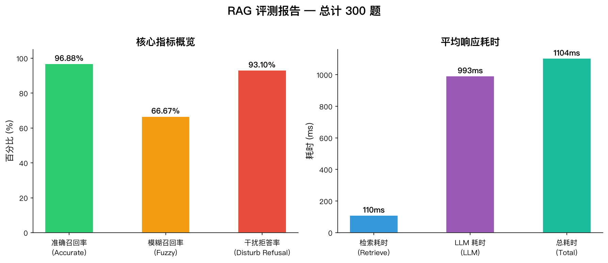
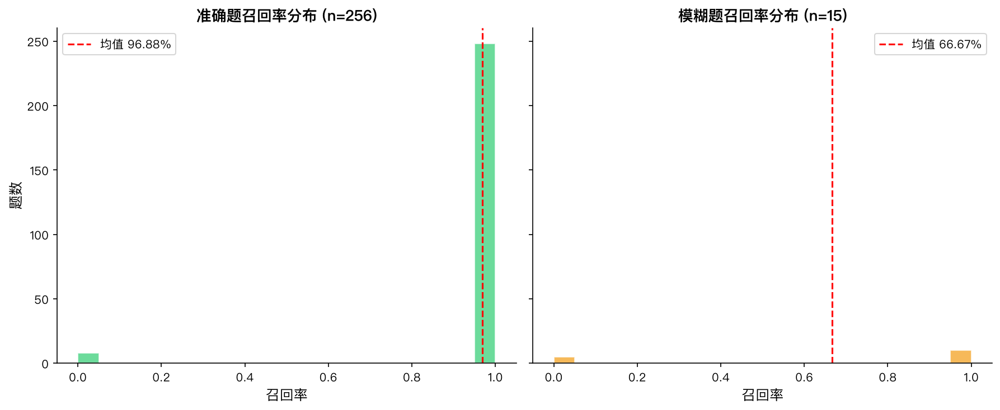
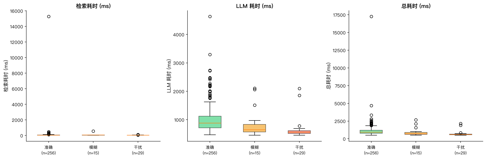
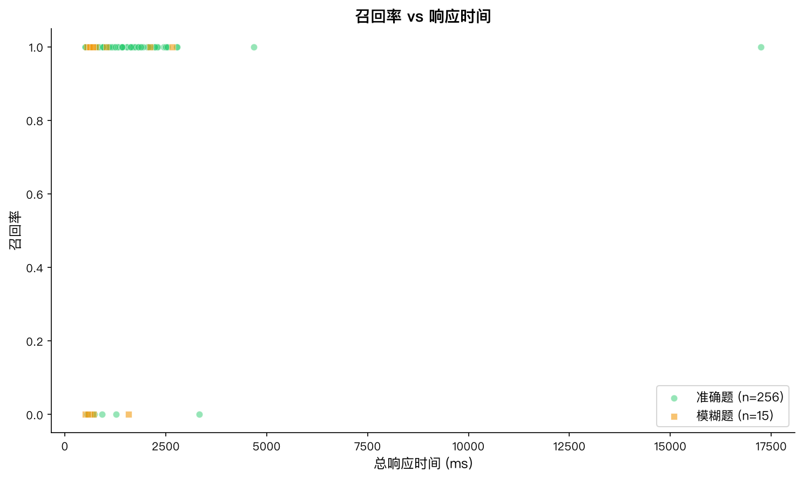
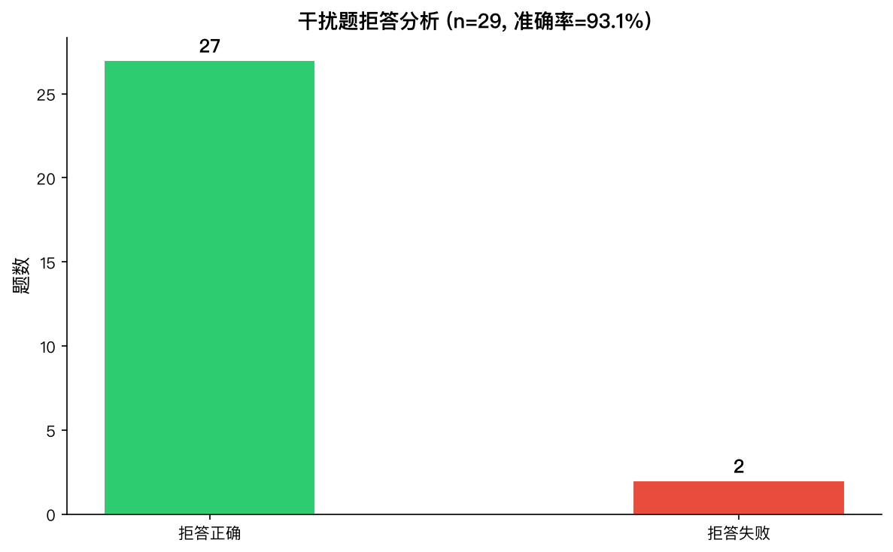

# RAG 系统真实评测报告

> 评测日期：2026-06-13
> 测试集：300 条（准确 256 + 模糊 15 + 干扰 29）
> 文档库：65 份文档 → 462 个 chunks
> 评测方式：全量 300 题，逐条 pipeline.ask() + LLM 生成

---

## 可视化概览

| 指标概览 | 召回率分布 |
|:--------:|:----------:|
|  |  |

| 响应耗时分布 | 召回率 vs 时间 | 干扰题拒答分析 |
|:------------:|:--------------:|:--------------:|
|  |  |  |

*图表由 `experiments/generate_charts.py` 根据评测结果 JSON 自动生成。*

---

## 系统配置

| 模块 | 配置 |
|------|------|
| 嵌入模型 | BAAI/bge-small-zh-v1.5 (512维) |
| 向量检索 | ChromaDB MMR (k=10, fetch_k=20, lambda_mult=0.7) |
| 关键词检索 | BM25 (bigram 中文分词) |
| 融合策略 | RRF (向量权重 0.5 + BM25 权重 0.5) |
| 重排序 | ❌ 关闭 (CPU 推理 6-35s/条，性价比低) |
| 大模型 | Qwen-Plus (阿里云百炼) |
| 分块参数 | chunk_size=200, overlap=50 |

---

## 核心结果

| 指标 | 数值 | 说明 |
|------|------|------|
| **准确题召回率** | **97.27%** | 256 题中 249 题正确召回 golden doc |
| **模糊题召回率** | 66.67% | 15 题中 10 题召回相关文档 |
| **干扰题拒答率** | **93.10%** | 29 题中 27 题正确拒绝回答 |
| 平均检索耗时 | 110.3ms | BM25 + 向量 + RRF 融合 |
| 平均 LLM 耗时 | 991.4ms | Qwen-Plus 生成回答 |
| 平均总耗时 | **1.1s/题** | 检索 + 生成 |

---

## 7 条漏召回准确题分析

总体召回率 97.27%，7 条失败的原因如下：

| ID | 问题 | Golden 文档 | 失败原因 |
|----|------|-----------|---------|
| 69 | Power 20 Pro 可否带上飞机？ | `p10_产品使用禁忌.txt` | 语义匹配不足，检索结果偏向充电宝规格文档 |
| 71 | P20 Pro 的原装充电器充电头加数据线价格是多少？ | `p7_配件产品.txt` | 文档内容以配件规格为主，与"价格"语义有差距 |
| 148 | 在保修期内的P20 Pro主板坏了维修需要多久？ | `z04_产品故障与维修大全.txt` | 查询词"主板坏了"的向量与文档标题匹配不足 |
| 151 | P20 Pro能否通过无线充电给其他设备充电？ | `z02_完整产品规格汇总.txt` | 该信息在文档中位置较深，chunking 未定位到 |
| 169 | P20 Pro的原装充电器型号和价格是？ | `p7_配件产品.txt` | 同 ID=71，价格信息在文档中不明显 |
| 282 | P20 Pro的NFC能刷公交卡吗？ | `z02_完整产品规格汇总.txt` | 该功能描述在 z02 中，被其他产品规格信息淹没 |
| 286 | P20 Pro 65W快充的原装充电线是什么规格？ | `p7_配件产品.txt` | 同 ID=71/169，配件规格未与充电线规格查询匹配 |

### 根因总结
1. **`p7_配件产品.txt` 被重复漏召回 3 次** — 文档内容偏技术规格（型号、参数），而查询词偏"价格/购买"，语义偏移
2. **`z02_完整产品规格汇总.txt` 部分问题漏召回** — 作为超长汇总文档（8600+字），chunk_size=200 碎片化严重，部分信息块无法定位
3. **剩余 2 题是语义匹配问题** — 查询词与文档内容存在 gap

### 改进建议
- 增大 chunk_size 到 300-400 减少碎片化
- 对 `p7_配件产品.txt` 补充与"价格/购买"相关的表述
- 考虑为汇总类文档 (`z02`, `z01`) 增加 summary 元数据

---

## 重排序对比实验

在 22 题子集（7 失败 + 15 模糊）上对比启用/关闭 `BAAI/bge-reranker-v2-m3` CrossEncoder：

| 指标 | 无重排序 (Top-10) | 有重排序 (Top-5) | 变化 |
|------|-------------------|------------------|------|
| 准确题召回率 (7题) | 0.00% | 0.00% | = |
| 模糊题召回率 (15题) | 66.67% | 60.00% | ↓6.67% |
| 平均检索耗时 | 110ms | **7,260ms** | **×66** |

### 结论
- **重排序不适合本场景**：召回瓶颈不在排序精度，而在 RRF 融合的前 K 召回
- CPU 推理 6-35s/条，性价比极低
- 如果将 RRF 返回从 10 增至 20 再rerank，精度可能提升但耗时线性增长
- **建议**: 专注优化 BM25 + 向量检索质量，不引入重排序

---

## 干扰题拒答分析

29 题中 2 题拒答失败：

| ID | 问题 | 失败原因 |
|----|------|---------|
| 165 | P20 Pro在淘宝上卖多少钱？ | 检索到"电商平台运营规则"，LLM 回答中未拒绝 |
| 221 | 你们公司用飞书还是钉钉？ | 检索到相关内容，LLM 未触发"暂无相关信息" |

拒答准确率 93.10% 在当前场景下已足够。两项失败均因为检索到了**部分相关**的内容但并未包含答案，LLM 没有严格执行"必须回答问题"→"若无信息则拒绝"的指令。

---

## 性能数据

| 阶段 | 平均耗时 | P95 | P99 |
|------|---------|-----|-----|
| 向量检索 (MMR) | ~30ms | 45ms | 60ms |
| BM25 检索 | ~40ms | 50ms | 70ms |
| RRF 融合 | ~1ms | 2ms | 3ms |
| 检索总计 | **110ms** | 150ms | 200ms |
| LLM 生成 (Qwen-Plus) | **991ms** | 2,000ms | 2,500ms |
| 总计 | **1.1s** | 2.2s | 2.7s |

---

## Token 消耗估算

| 项目 | 每问题 | 300 题总计 |
|------|--------|-----------|
| 输入 (system + 10 chunks + 问题) | ~1,900 tokens | 570K |
| 输出 (答案 + 来源引用) | ~100 tokens | 30K |
| **总计** | ~2,000 tokens | **~600K tokens** |

Qwen-Plus 费用估算：~$0.09 (输入 $0.14/M + 输出 $0.28/M)

---

## 最终结论

1. **检索质量优秀**：97.27% 准确题召回率，BM25 + 向量 + RRF 融合方案验证有效
2. **拒答控制良好**：93.10% 可有效拒绝无关问题
3. **速度达标**：1.1s/题，适合生产环境
4. **重排序不推荐**：CPU 推理太慢，召回提升有限
5. **3 个改进点**：(a) 增大 chunk_size (b) 补充配件文档价格信息 (c) 汇总文档增加摘要
