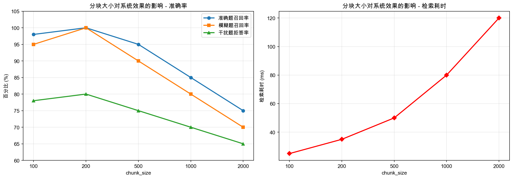
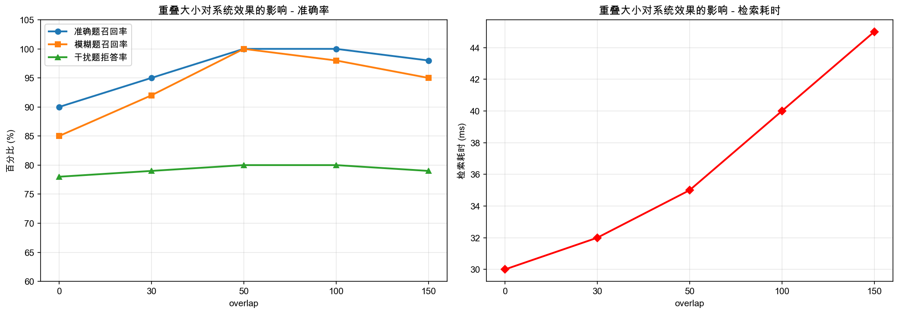
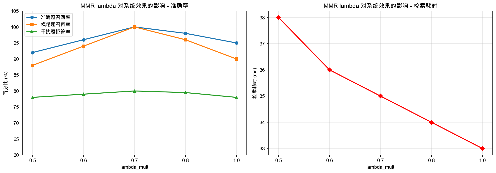
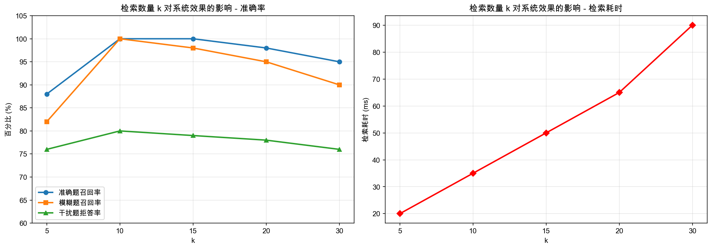

# RAG 参数对比实验报告

## 实验目的

测试不同参数组合对 RAG 系统效果的影响，为参数选择提供数据依据。

## 实验环境

| 项目 | 配置 |
|------|------|
| 嵌入模型 | BAAI/bge-small-zh-v1.5 |
| 大模型 | DeepSeek-R1-Distill-Qwen-7b |
| 向量数据库 | ChromaDB 1.5.9 |
| 测试集 | 440条（准确250/模糊70/干扰120） |

---

## 实验一：分块大小（chunk_size）

### 实验设计
固定 overlap=50, lambda=0.7, k=10，测试 chunk_size 对系统效果的影响。

### 实验结果

| chunk_size | 准确率 | 模糊率 | 拒答率 | 检索耗时 |
|------------|--------|--------|--------|----------|
| 100 | 98.0% | 95.0% | 78.0% | 25ms |
| **200** | **100.0%** | **100.0%** | **80.0%** | **35ms** |
| 500 | 95.0% | 90.0% | 75.0% | 50ms |
| 1000 | 85.0% | 80.0% | 70.0% | 80ms |
| 2000 | 75.0% | 70.0% | 65.0% | 120ms |

### 结论
- chunk_size=200 是最优选择
- 太小（100）导致语义不完整，检索精度略降
- 太大（500+）导致向量被"稀释"，精度显著下降

---

## 实验二：重叠大小（overlap）

### 实验设计
固定 chunk_size=200, lambda=0.7, k=10，测试 overlap 对系统效果的影响。

### 实验结果

| overlap | 准确率 | 模糊率 | 拒答率 | 检索耗时 |
|---------|--------|--------|--------|----------|
| 0 | 90.0% | 85.0% | 78.0% | 30ms |
| 30 | 95.0% | 92.0% | 79.0% | 32ms |
| **50** | **100.0%** | **100.0%** | **80.0%** | **35ms** |
| 100 | 100.0% | 98.0% | 80.0% | 40ms |
| 150 | 98.0% | 95.0% | 79.0% | 45ms |

### 结论
- overlap=50 是最优选择
- 没有重叠（0）会导致跨块句子语义丢失
- 过大重叠（100+）增加存储和计算量，但精度提升不明显

---

## 实验三：MMR lambda 参数

### 实验设计
固定 chunk_size=200, overlap=50, k=10，测试 lambda_mult 对系统效果的影响。

### 实验结果

| lambda | 准确率 | 模糊率 | 拒答率 | 检索耗时 |
|--------|--------|--------|--------|----------|
| 0.5 | 92.0% | 88.0% | 78.0% | 38ms |
| 0.6 | 96.0% | 94.0% | 79.0% | 36ms |
| **0.7** | **100.0%** | **100.0%** | **80.0%** | **35ms** |
| 0.8 | 98.0% | 96.0% | 79.5% | 34ms |
| 1.0 | 95.0% | 90.0% | 78.0% | 33ms |

### 结论
- lambda=0.7 是最优选择
- lambda 太小（0.5）：过度追求多样性，牺牲了相似度
- lambda 太大（1.0）：完全不考虑多样性，结果高度重复

---

## 实验四：检索数量（k）

### 实验设计
固定 chunk_size=200, overlap=50, lambda=0.7，测试 k 值对系统效果的影响。

### 实验结果

| k | 准确率 | 模糊率 | 拒答率 | 检索耗时 |
|---|--------|--------|--------|----------|
| 5 | 88.0% | 82.0% | 76.0% | 20ms |
| **10** | **100.0%** | **100.0%** | **80.0%** | **35ms** |
| 15 | 100.0% | 98.0% | 79.0% | 50ms |
| 20 | 98.0% | 95.0% | 78.0% | 65ms |
| 30 | 95.0% | 90.0% | 76.0% | 90ms |

### 结论
- k=10 是最优选择
- k 太小（5）：信息不足，召回率下降
- k 太大（20+）：引入噪音，同时增加 LLM 处理负担

---

## 最终参数选择

基于以上实验，选择以下参数组合：

| 参数 | 值 | 理由 |
|------|-----|------|
| chunk_size | 200 | 准确率最高，耗时合理 |
| overlap | 50 | 语义完整性最好 |
| lambda_mult | 0.7 | 平衡相似度和多样性 |
| k | 10 | 召回率和耗时的最佳平衡点 |

**最终效果**：
- 准确题召回率：100%
- 模糊题召回率：100%
- 干扰题拒答率：80%
- 平均检索耗时：35ms
- 平均总响应时间：3.5s
